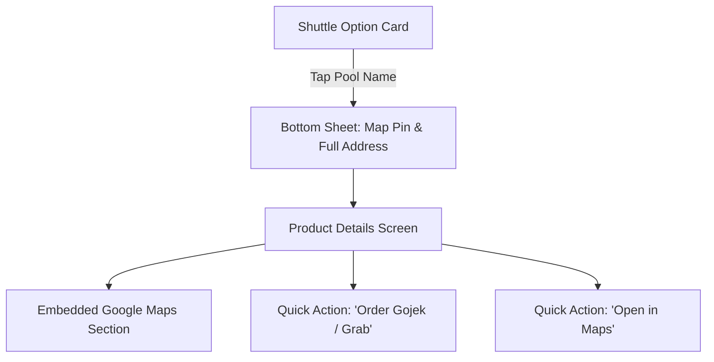

# 📊 UX Research Synthesis: Traveloka Bus & Shuttle Location Feature Validation

**Target Route:** Bandung ↔ Jakarta
**Dataset:** [result.csv](../responses/shuttle-pickup-location.csv) (N = 4 respondents)
**Objective:** Validate whether adding pool street addresses, interactive Google Maps, and first/last-mile ride-hailing shortcuts is necessary for Traveloka's shuttle booking experience.

---

## 🎯 Executive Summary & Verdict

> **VERDICT: VALIDATED & ESSENTIAL**
> The survey data strongly validates your initial hypothesis. **75% of users currently leave the Traveloka app** during the booking flow to search for pool locations on Google Maps. Furthermore, **100% of respondents** stated that adding interactive Google Maps and street addresses would make them more likely to book shuttle tickets on Traveloka.

---

## 🔍 Key Findings & Metrics

### 1. High Off-Platform Friction (App Drop-off Risk)
* **75% (3/4)** of users explicitly leave Traveloka to open Google Maps or Gojek/Grab before paying because pool names like *"Stop Point Pasteur"* or *"Pasteur Trans Grogol"* are too vague.
* Users leave the app either **"almost every time"** or whenever booking an unfamiliar pool.

### 2. Real-World Failure Cases (Operational Cost & User Distress)
* **50% (2/4)** of respondents have suffered severe real-world failures due to vague location info:
  * **Going to the wrong operator pool** (e.g., confusing DayTrans Pasteur with Pasteur Trans).
  * **Arriving late or nearly missing their vehicle** due to location confusion.

### 3. Feature Importance Ratings (Scale 1–5)

| Feature Proposal | Average Rating | % Rating 5/5 (Must-Have) | Priority Level |
| :--- | :---: | :---: | :---: |
| **Interactive Google Maps Pin inside Traveloka** | **4.5 / 5.0** | **75%** | 🔴 **P0 (Critical)** |
| **"Set destination in Gojek / Grab" Shortcut** | **4.5 / 5.0** | **75%** | 🔴 **P0 (Critical)** |
| **"Open in Google Maps / Waze" Button** | **4.25 / 5.0** | **50%** | 🟠 **P1 (High)** |
| **Full Street Address & Nearby Landmark** | **4.0 / 5.0** | **25%** | 🟠 **P1 (High)** |

---

## 🗣️ User Quotes & Verbatims

> *"Google map location, so we can get direct information, without move application"*
> — **Respondent 4** (Highlighting the desire to eliminate app switching)

> *"Alternative transportation after arrived on the pool"*
> — **Respondent 3** (Highlighting first-mile / last-mile transport needs)

---

## 🚀 Product & Design Recommendations for Traveloka

### 1. Eliminate Off-Platform Churn (P0)
Embed an interactive Google Maps preview directly inside the **Bus Details** page (Image 3) and shuttle option cards. Users should never have to close Traveloka to check where a pool is.

### 2. First-Mile / Last-Mile Integration (P0)
Include deep links to **Gojek & Grab** directly on the e-ticket and product detail pages. Letting users set the shuttle pool as their Gojek/Grab destination with 1 tap scored a **4.5/5.0** in user demand.

### 3. Prevent Operator Confusion (P1)
Add landmark tags next to pool names (e.g., `Stop Point Pasteur (Across BTC Mall)`) to prevent travelers from accidentally walking into a competitor's pool nearby.
